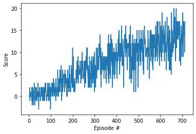

# Report

## Learning Algorithm

Tha learning algorithm used here is implemented the vanilla Deep Q Learning paper with Experience Replay and Fixed Q-targets.

The algorithm implementation has the following structure: Creates a list and a buffer of `scores`; iterates through a number of episodes resetting the `environment` to get a new `state` on each iteration; a second loop is created per episode to iterate through a number of `steps`, here an `action` is selected based on the previous state and sent to the environment, a `next state` is returned using the `vector observations` from that action and it also gets a `reward`; checks if the episode has finished and takes a new `step` using the `previous state`, the `action`, the `reward`, the `new state` and the `done` status; it updates the `score` and `state` values; after this step the `score` list is updated with the `new score` and decrease the value of `epsilon`. Then it proceedes to start a new episode. The training will be completed when the expected average score is reached.

The `Q network` used for the agent is fairly simple; it consists of:
* Three `Linear layers`
* Two `ReLU` activation funtions after the first two `Linear layers`.
* The `state size` comes from the `vector observations` when resetting the `environment` and it's the input for the network, with an output of `64 dimentions`. Then, ather the `ReLU` layer we pass the previous output through the next `Linear layer` which outputs a value of `64 dimensions` again and sent through the second `rectified linear unit`. The last layer receives the input from the previous layer and outputs the `action size` for the agent.
The `Agent` then instantiates this network twice in order to use the `online` and `target` method; where the `online nwetwork` is updated at every gradient step and the `target network` is updated using the weights from the `online network` at regular intervals. The `Agent` uses `Adam` as the `optimiser`. Then a `Replay Buffer` is ussed to avoid using experiences too close to each other when we train the netwroks; this way a random batch is sampled from the buffer and then used to calculate the value function.

The hyperparameters used in the DQN training algorithm:

* Max number of steps per episode: `1000`
* Epsilon start: `1.0`
* Epsilon end: `0.01`
* Epsilon decay: `datailed below`

The results below show the progress during the training phase using two different epsilon decay values. Further reductions in that value show that the training speed can be improved even more, as we can see below where we show the results for `eps_decay=0.997`. For the purpose of this report the expamples provided should be sufficient.

## Results (eps_decay=0.999)

Episode 100	Average Score: 0.07  
Episode 200	Average Score: 0.73  
Episode 300	Average Score: 1.65  
Episode 400	Average Score: 2.39  
Episode 500	Average Score: 3.62  
Episode 600	Average Score: 4.55  
Episode 700	Average Score: 5.06  
Episode 800	Average Score: 6.53  
Episode 900	Average Score: 7.39  
Episode 1000	Average Score: 8.11  
Episode 1100	Average Score: 8.91  
Episode 1200	Average Score: 8.84  
Episode 1300	Average Score: 9.67  
Episode 1400	Average Score: 10.38  
Episode 1500	Average Score: 9.940  
Episode 1600	Average Score: 10.79  
Episode 1700	Average Score: 11.41  
Episode 1800	Average Score: 12.16  
Episode 1900	Average Score: 11.35  
Episode 2000	Average Score: 11.36  
Episode 2100	Average Score: 12.13  
Episode 2200	Average Score: 11.89  
Episode 2300	Average Score: 11.82  
Episode 2400	Average Score: 11.90  
Episode 2434	Average Score: 13.09

`Environment solved in 2334 episodes!	Average Score: 13.09`

## Results (eps_decay=0.997)

Episode 100	Average Score: 0.43\
Episode 200	Average Score: 2.62\
Episode 300	Average Score: 5.29\
Episode 400	Average Score: 7.83\
Episode 500	Average Score: 9.73\
Episode 600	Average Score: 11.17\
Episode 700	Average Score: 12.74\
Episode 714	Average Score: 13.02

`Environment solved in 614 episodes!	Average Score: 13.02`

## Ideas for Future Work

* Hyperparameter tuning and optimisation
* Implement `prioritised experience replay` to improve efficiency.
* Explore new DQN implementations like `douoble DQN` and `dueling DQN`
* Learn from pixes as oposed to the current `vector observations` to improve versatility.
